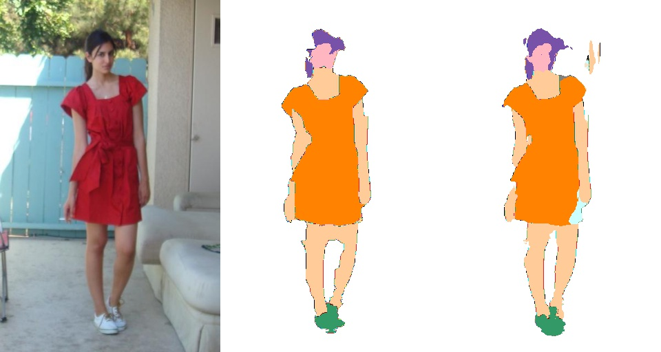
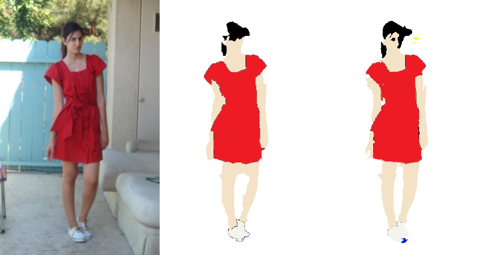

# Fashion item Segmentation based on Unet

This repository implements fashion item segmentation on color and category

## Requirements
* python3.6+
* pytorch 1.7.1
* others.

## Usage
training a model
```bash
python3 main.py --config config.yml
```

testing a model
```bash
Not implmented yet
```

## Results
### Category

### Color


## Comments
The result is not good because dataset is small and unet is simple. Deeplab-v3 and other network is recommended. 


## Reference
1. unet : https://github.com/milesial/Pytorch-UNet
2. dataset : https://github.com/hrsma2i/dataset-CFPD
